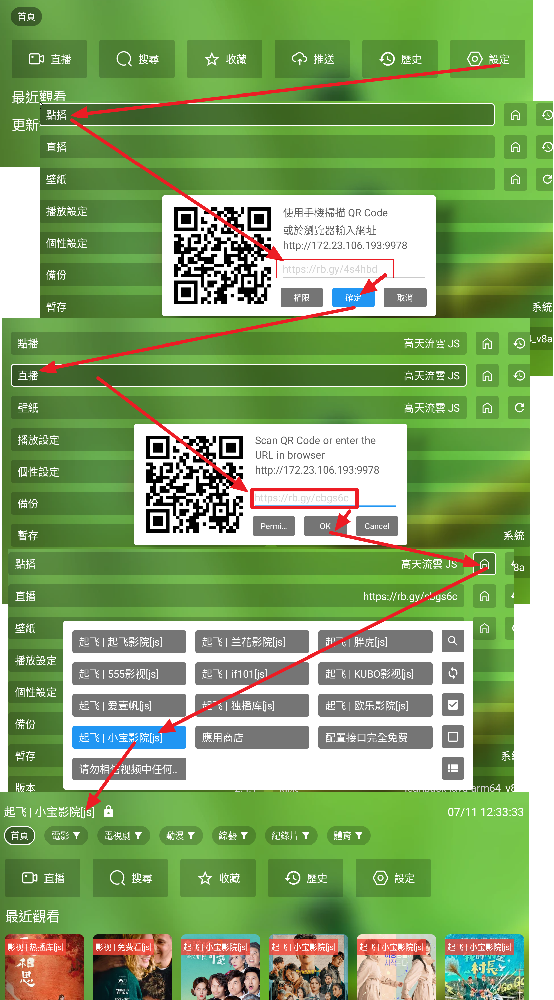

# 這裏所有資料與碼僅供研究，測試，與學習． 請勿用於非法用途，否則後果自負

----------------------------------------------------------



# 蜂蜜 & TVBoxOSC

## 兩大系統："FongMi 蜂蜜與唐三維護: 影視ＴＶ, 蜂蜜影視"　與　"TVBoxOSC"　基礎概念

1. 接口　（源）－＞線路－＞站源　（一個接口可以包含很多線路，一個線路可以包含很多站源）
   1. 搜尋時，可以會自動搜尋同一個線路的所有站源的片
   2. 片上長按，可以搜尋所有站源的片
   3. ＂蜂蜜＂影視ＴＶ系列的下游播放器，　如: 寶盒，西夏，開心，天微，木魚，猫TV，春盈天下，三林，欧歌，星辰...
   4. 每條線路有自己的歷史記錄
2. 推薦：　蜂蜜影視ＴＶ　與　ＯＫＴＶ．　同Fongmi蜂蜜系列，支援注音輸入，直播多線路選擇，有英文，繁中，簡中選項，支援直播多線、自動換源、直播倍速，Ai去廣告等功能，手機投影螢幕等
   1. 蜂蜜影視ＴＶ 唐三 <https://xhdwc.tk/> or <https://github.com/FongMi/Release> or <https://github.com/FongMi/TV> or <https://github.com/FongMi/Release/tree/fongmi/apk>
   2. ＯＫＴＶ <https://github.com/FongMi/Release/tree/main/apk>
3. 常見版本：　<https://github.com/dlgt7/TVbox-interface/blob/main/tvbox%E5%B8%B8%E8%A7%81%E7%89%88%E6%9C%AC.md>
4. <https://www.wmdz.com/tvboxFM.html> (List of many apps)

## 安裝方式

1. 電視上先裝 downloader (使用Google play 或 <https://www.aftvnews.com/downloader>)
2. 選擇以下APP安裝: (https://go.aftvnews.com/)

   | App               | 版本       | Downloader 碼 | 鏈接                        |     |
   | ----------------- | ---------- | ------------- | --------------------------- | --- |
   | 1. 蜂蜜影視TV     | 電視版 v7a | 5012184       | <https://aftv.news/5012184> |     |
   | 1. 蜂蜜影視TV     | 手機版     | 2526465       | <https://aftv.news/2526465> |     |
   | 1. 蜂蜜影視TV     | 手機版 64  | 6545803       | <https://aftv.news/6545803> |     |
   | 2. 魚佬WebHTV (蜂蜜延伸版)  | 電視版 v7a | 7645782 | <https://aftv.news/7645782> |     |
   | 2. 魚佬WebHTV (蜂蜜延伸版)  | 電視版 v8a | 6225370      | <https://aftv.news/6225370> |     |
   | 2. 魚佬WebHTV (蜂蜜延伸版)  | 手機版 v7a | 9650556      | <https://aftv.news/9650556> |     |
   | 2. 魚佬WebHTV (蜂蜜延伸版)  | 手機版 v8a |4414272 | <https://aftv.news/4414272> |     |
   | 3. WebHTV (魚佬延伸版)  | 電視版 v7a | 6253631 | <https://aftv.news/6253631> |     |
   | 3. WebHTV (魚佬延伸版)  | 電視版 v8a | 3473900| <https://aftv.news/3473900> |     |
   | 3. WebHTV (魚佬延伸版)  | 手機版 v7a | 8647017 | <https://aftv.news/8647017> |     |
   | 3. WebHTV (魚佬延伸版)  | 手機版 v8a | 8825308 | <https://aftv.news/8825308> |     |
   | 4. SmartTube      | Stable     | 308699        | <https://aftv.news/308699>  |     |
   | 4. SmartTube      | Beta       | 766033        | <https://aftv.news/766033>  |     |
   | 5. OKTV DB Backup | RobYang    | 9676810       | <https://aftv.news/9676810> |     |


### OK 影視TV !!不再更新!!
   | App               | 版本       | Downloader 碼 | 鏈接                        |     |
   | ----------------- | ---------- | ------------- | --------------------------- | --- |
   | 1. OK影視TV (不再更新)       | 電視版 v7a | 7880313       | <https://aftv.news/7880313> |     |
   | 1. OK影視TV (不再更新)         | 電視版 v8a | 8679516       | <https://aftv.news/8679516> |     |
   | 1. OK影視TV (不再更新)         | 手機版 v7a | 1826661       | <https://aftv.news/1826661> |     |
   | 1. OK影視TV (不再更新)         | 手機版 v8a | 8679516       | <https://aftv.news/8679516> |     |
   | 2. OK pro影視TV (不再更新)     | 電視版 v7a | 3618792       | <https://aftv.news/3618792> |     |
   | 2. OK pro影視TV (不再更新)     | 電視版 v8a | 6778637       | <https://aftv.news/6778637> |     |
   | 2. OK pro影視TV (不再更新)     | 手機版 64  | 4504710       | <https://aftv.news/4504710> |     |


## 點播接口

1. Rob Yang 點直播線源: <http://RobYang.eu.cc> 或 <http://RobYang.dpdns.org> 或 <https://RobYang.zone.id> 或 <https://RobYang.serv00.net>
2. AnBox <http://tv.anbox.ip-ddns.com/vod>
4. 沐晨: <https://py.doube.eu.org/static/t4.json>
5. 寶盒=歐樂,泥巴　<https://raw.githubusercontent.com/guot55/yg/main/pg/jsm.json>
6. 泥巴,獨播庫,小寶,歐樂,腐劇　<https://raw.githubusercontent.com/qist/tvbox/master/jsm.json> (<https://github.com/qist/tvbox>)
7. <https://raw.githubusercontent.com/gaotianliuyun/gao/master/js.json> （<https://github.com/gaotianliuyun/gao/tree/master）>
8. <http://home.jundie.top:81/top98.json>
9. <https://raw.githubusercontent.com/jake3737/tvbox/master/js.json>
10. 教學 <https://gitlab.com/xmbjm/omg/-/raw/main/omg.json>
11. 歐樂,泥巴 (online js) <https://gitlab.com/-/snippets/2343779/raw/main/snippetfile1.txt>

## 直播接口

1. Rob Yang 點直播線源: <http://RobYang.dpdns.org> 或 <https://RobYang.serv00.net> 或 <http://robyang.zone.id> 或 <http://RobYang.runasp.net>
2. AnBox <http://tv.anbox.ip-ddns.com/live>
3. Jack直播: <https://php.946985.filegear-sg.me/jackTV.m3u>  (Taiwan IP only)
4. <https://www.juwanhezi.com/more/live>
5. <http://曉峰.azip.dpdns.org:5008/?type=m3u> (Taiwan IP only)
6. Judy: <https://raw.githubusercontent.com/judy-gotv/iptv/refs/heads/main/4GTV.m3u>  (Taiwan IP only)
7. <https://php.946985.filegear-sg.me/jackTV.m3u> (slow.. change channels)

## 多接口List

1. <https://yang-1989.eu.org/>
2. <https://raw.githubusercontent.com/cyalias/mytvs-github/refs/heads/main/myjk.json>
3. <https://tvbox.youdu.fan>
4. <https://www.upx8.com/4021>
5. <https://xn--qoqw77q.top/dcjk.html>
6. <http://www.52sw.top:678/play/oj1381/index.php?get=159169>
7. <https://tianyastudio.blogspot.com/search/label/TV>
8. <https://github.com/li5bo5/TVBox?tab=readme-ov-file>
9. International: <https://iptv-org.github.io/iptv/index.m3u> (<https://github.com/iptv-org/iptv>)
10.

## 特別解析json

1. <https://github.com/wnddwc/daiweichun>

## PG包　（本地包）

1. <https://github.com/gaotianliuyun/gao/tree/master>

## 如何為影視倉設定內建來源介面？

1. <https://tianyastudio.blogspot.com/search/label/TVBOX>
2. <https://www.youtube.com/watch?v=WI9dwvzNBkY>

-----

## TVbox Info

1. <https://github.com/FongMi/TV>
2. <http://m.wmsio.cn/nd.jsp?mid=324&id=30&groupId=0>
3. <https://github.com/qist/tvbox>

## Emoji

1. <https://emojiterra.com/>
2. <https://emojipedia.org/>
3. <https://symbl.cc/cn/unicode-table/>

## 直播網站

1. 電視直播：<http://tonkiang.us/>
2. 夜視直播：<https://yeslivetv.com/>
3. 港台直播(VPN)：www.stream-link.org/
4. <https://www.ofiii.com/channel/watch/4gtv-4gtv040>
5. 國外 m3u： <https://tinyurl.com/multiservice21?region=us&service=Plex&sort=name> （作者: <https://github.com/dtankdempse/free-iptv-channels）>

## GitHub Proxy 代理加速

1. <https://gh.con.sh/https://raw.githubusercontent.com/>
2. <https://github.moeyy.xyz/https://raw.githubusercontent.com/>
3. <https://mirror.ghproxy.com/raw.githubusercontent.com/>
4. <https://ghproxy.com/https://raw.githubusercontent.com/>
5. <https://ghproxy.net/https://raw.githubusercontent.com/>
6. <https://mirror.ghproxy.com/https://raw.githubusercontent.com/>
8. <https://already.free.hr/>
9. <https://raw.gitmirror.com/>
10. <https://gh-proxy.com/https://raw.githubusercontent.com/>
11. <https://a.ouhuang.onflashdrive.app/https://raw.githubusercontent.com/>
12. <https://githubfd.deno.dev/>
13. <https://ghp.ci/https://raw.githubusercontent.com/>

--------------------------------------------------------------------

## 其他 Tools

1. txt 轉 繁體m3u: <http://www1.RobYang.ggff.net/TxtM3u?to=m3u&l=taiwan&url=https://2912.kstore.space/520.txt>
13. txt 轉 m3u: <http://www1.RobYang.ggff.net/TxtM3u?to=m3u&l=china&url=https://2912.kstore.space/520.txt>
14. m3u 轉 繁體txt: <http://www1.RobYang.ggff.net/TxtM3u?url=https://www.stream-link.org/stream-link.m3u>
13. m3u 轉 txt: <http://www1.RobYang.ggff.net/TxtM3u?l=china&sortChannel=false&url=https://www.stream-link.org/stream-link.m3u>
14. m3u 轉 txt: <https://fanmingming.com/txt?url=https://www.stream-link.org/stream-link.m3u>
15. txt m3u 轉換工具 <https://guihet.com/convert-m3u-js.html>
16. Other link Source <https://beatsingdrama.blogspot.com/p/xt-playlist-txt.html?m=1>
17. detect good urls and remove old <https://hub.docker.com/r/2011820123/tvbox>
18. Emotn: 331026, 796233, 202096
19. downloader App <https://www.aftvnews.com/downloader/>, 383716 to download emotn
20. [WebGrab + Plus](http://www.webgrabplus.com/) 多站點增量XMLTV EPG採集器。
21. [IPTV Checker](https://www.npmjs.com/package/iptv-checker) — Node.js的IPTV播放列表檢查器
22. [Streamtest](https://streamtest.in/) 免費且易於使用的基於Web的流測試器實用程序。
23. [M3U Edit](https://www.gtrigonakis.com/m3u-edit)
24. [直播源在線監測工具](http://cha.znds.com)
25. Decoder: <https://shixiong.alwaysdata.net/>

--------------------------------------------------------------------

## EPG

1. <https://assets.livednow.com/epg.xml>
2. <https://diyp.112114.xyz/?serverTimeZone=Asia/Hong_Kong&ch={name}&date={date}>
3. <https://diyp1.112114.xyz/?serverTimeZone=Asia/Hong_Kong&ch={name}&date={date}>
1. <https://diyp2.112114.xyz/?serverTimeZone=Asia/Hong_Kong&ch={name}&date={date}>
6. <https://epg.112114.xyz/?serverTimeZone=Asia/Hong_Kong&ch={name}&date={date}>
7. <https://epg.112114.free.hr/?serverTimeZone=Asia/Hong_Kong&ch={name}&date={date}>
8. <https://epg.112114.eu.org/?serverTimeZone=Asia/Hong_Kong&ch={name}&date={date}>
9. <https://skytv.serv00.net/epg.php?serverTimeZone=Asia/Hong_Kong&ch={name}&date={date}>
10. <https://epg.v1.mk/json?serverTimeZone=Asia/Hong_Kong&ch={name}&date={date}> (<https://epg.v1.mk/json?serverTimeZone=Asia/Hong_Kong&ch=cctv1&date=20240604>)
11. <http://hk.doube.eu.org/EPG/epg.php?serverTimeZone=Asia/Hong_Kong&ch={name}&date={date}>
12. <https://cdn.1678520.xyz/epg/?serverTimeZone=Asia/Hong_Kong&ch={name}&date={date}>
13. <https://epg.mxdyeah.top/api/diyp/?serverTimeZone=Asia/Hong_Kong&ch={name}&date={date}>
14. <https://epg.0472.org/?serverTimeZone=Asia/Hong_Kong&ch={name}&date={date}>
15. <http://epg.51zmt.top:8000/e.xml>
16. <http://epg.diyp.top/diyp/epg.php?serverTimeZone=Asia/Hong_Kong&ch={name}&date={date}>
17. [EPG for IPTV](https://www.iptv-epg.com/) - EPG服務提供商，為全球IPTV提供個性化的電子節目指南。
18. [epg.streamstv.me](http://epg.streamstv.me/epg/) 歐亞大陸和北美頻道的節目指南。
19. [IPTVX|one](https://iptvx.one/viewtopic.php?f=12&t=4&sid=5d7f43099b396af229d5961ec746fc14) 主要用於CIS頻道的節目指南。
20. [i.mjh.nz](http://i.mjh.nz/) 來自澳大利亞，新西蘭和南非的頻道的節目指南。
21. <https://epg.iill.top/epg>
22. 日本頻道 <http://epg.pw/xmltv/epg_JP.xml>
23. 台灣頻道 <http://epg.pw/xmltv/epg_TW.xml>

--------------------------------------------------------------------

## 每年需要在json, js, xml 新增年度

```
1.
2025&2024&
2026&2025&2024&

2.
"2025", "2024"
"2026", "2025", "2024"

3.
,{"n":"2025","v":"/year/2025"}
,{"n":"2026","v":"/year/2026"},{"n":"2025","v":"/year/2025"}

4.
,{n:"2025",v:"2025"}
,{n:"2026",v:"2026"},{n:"2025",v:"2025"}

5.
, {"n": "2025", "v": "2025"}
, {"n": "2026", "v": "2026"}, {"n": "2025", "v": "2025"}

6.
{"n":"2025","v":"2025"},
{"n":"2026","v":"2026"},{"n":"2025","v":"2025"},


```

--------------------------------------------------------------------

格式說明 <http://www.sharerw.com/a/ziyuan/444.html>:

1. 《分享者tv》 《百川影音》自定義直播源的分類寫法為: ### $c_start央視$c_end
2. 《DIYP影音》《視米趣播》: ### 央視,#genre#
3. 節目名,地址1#地址2,epg-id(比如CCTV1它的ID是cntv-cctv1) : 工具: <http://epg.51zmt.top:8000/>

    即在原來的播放列表的每一個項後面加上EPG-ID，舉個例子:

CCTV-1HD,<http://stream.guihet.com/hd/ccav1.m3u8,cntv-cctv1>
CCTV-1HD,<http://stream.guihet.com/hd/ccav1.m3u8,tvming-CCTV1HD>

--------------------------------------------------------------------

OK影視、TVBox、貓影視配置文件。所有資源均來自於各路大神無私分享，如有侵權，請聯繫刪除。

所有以任何方式查看本倉庫內容的人、或直接或間接使用本倉庫內容的使用者都應仔細閱讀此聲明。本倉庫管理者保留隨時更改或補充此免責聲明的權利。一旦使用、複製、修改了本倉庫內容，則視為您已接受此免責聲明。

本倉庫管理者不能保證本倉庫內容的合法性、準確性、完整性和有效性，請根據情況自行判斷。本倉庫內容，僅用於測試和學習研究，禁止用於商業用途，不得將其用於違反國家、地區、組織等的法律法規或相關規定的其他用途，禁止任何公眾號、自媒體進行任何形式的轉載、發布，請不要在中華人民共和國境內使用本倉庫內容，否則後果自負。

本倉庫內容中涉及的第三方硬件、軟件等，與本倉庫內容沒有任何直接或間接的關係。本倉庫內容僅對部署和使用過程進行客觀描述，不代表支持使用任何第三方硬件、軟件。使用任何第三方硬件、軟件，所造成的一切後果由使用的個人或組織承擔，與本倉庫內容無關。

所有直接或間接使用本倉庫內容的個人和組織，應 24 小時內完成學習和研究，並及時刪除本倉庫內容。如對本倉庫內容的功能有需求，應自行開發相關功能。所有基於本倉庫內容的源代碼，進行的任何修改，為其他個人或組織的自發行為，與本倉庫內容沒有任何直接或間接的關係，所造成的一切後果亦與本倉庫內容和本倉庫管理者無關。

1. tvbox配置：

（1）0707.json  OK影視多線配置接口,僅適用於Fengmi影視；

（2）0821.json  大而全的配置，在飯太硬配置的基礎上添加了若干優質點播源、直播線路和解析；

（3）0822.json  極簡配置，OK大佬的jar，還包括幾條路飛、俊于的源。

（4）0825.json  小而精的配置，jar包來源於Panda Groove的go包，其中泥巴、星星等，需要替換成自己的代理url；

（5）0826.json  完全來源於飯太硬的jar包和配置；

（6）0827.json  jar包和配置來源於fongmi；

（7）0828.json  jar包和配置來源於唐三；

（8）js.json  jar包來源於Panda Groove的go包，資源來源於道長drpy(js)倉庫 添加 YouTube 直播；

（9）XBPQ.json  XBPQ源，jar包和配置來源於小米小爆脾氣；

（10）XYQ.json  XYQ源，jar包和配置來源於香雅情；

（11）cat.json  cat源，資源來源於網絡各路大佬。/cat/js配合貓影視可直接食用；

（12） jsm.json 來自js.json + 0826.json 合集 家庭電視可用 刪除YouTube 直播，OK影視 可用 電視建議使用OK影視 <https://github.com/FongMi/Release> 支持多直播選擇。

貓影視使用github 配置

 配置教程：<https://omii.top/1296.html>

`注意使用Gitee或Github導入，並設置為私有倉庫，CatVodOpen僅支持私有倉庫跟dav`

V1.1.3版本以上

`github://Token@github.com/xxxxx/tvbox/dist/index.js.md5`

改動

* quickjs改為nodejs，proxy設置修改
* 在ios上無法使用local，使用db替換local所有方法
* nodejs 的優勢在於更加靈活

V1.1.2版本以下

`github://Token@gitee.com/xxxxx/tvbox/js/open_config.json`

1. APP推薦:

（1）OK影視版本  項目地址：<https://github.com/FongMi/TV> 支持直播多線路、自動換源、直播倍速，手機投屏；

（2）q215613905版本  項目地址：<https://github.com/q215613905/TVBoxOS> 支持直播回放；

（3）takagen99版本  項目地址：<https://github.com/takagen99/Box> 支持直播回放，界面美觀；

（4）皮皮蝦版本  發布頻道：<https://t.me/pipixiawerun> 支持直播回放，支持彈幕；

（5）新版貓影視   項目地址：<https://github.com/catvod/CatVodOpen> 界面簡潔，支持多平台。

（6）手機版本  項目地址：<https://github.com/XiaoRanLiu3119/TVBoxOS-Mobile> 豎屏

（7）q215613905 takagen99 編譯apk 項目地址：<https://github.com/o0HalfLife0o/TVBoxOSC>

3. TVBox各路大佬配置（排名不分先後）：

（1）飯太硬：<http://www.飯太硬.top/tv/>

（2）okjack：<https://jihulab.com/okcaptain/kko/raw/main/ok.txt>

（3）王二小放牛娃：<http://tvbox.王二小放牛娃.xyz>

（4）摸魚兒：<http://我不是.摸魚兒.top>

（5）霜輝月明py：<https://999740.xyz/raw.githubusercontent.com/lm317379829/PyramidStore/pyramid/py.json>

（6）小米小爆脾氣：<http://xhww.fun/小米/DEMO.json>

（7）南風：<https://agit.ai/Yoursmile7/TVBox/raw/branch/master/XC.json>

（8）神器：<https://神器每日推送.tk/pz.json>

（9）巧技：<http://pandown.pro/tvbox/tvbox.json>

（10）Ray：<https://100km.top/0>

（11）俊于：<http://home.jundie.top:81/top98.json>

（12）橘子柚：<https://mirror.ghproxy.com/https://raw.githubusercontent.com/hackyjso/box/main/jzy.txt>

（13）電視（自用）： <https://github.moeyy.xyz/raw.githubusercontent.com/qist/tvbox/master/jsm.json>

（14）github代理地址： `https://github.moeyy.xyz https://mirror.ghproxy.com/ https://gh-proxy.com https://ghproxy.net` 選擇一個速度快使用

（15） 還可以使用域名: `https://qist.ugigc.us.kg/jsm.json` cloudflare Pages 構建

1. token.json格式說明：

模板文件json/tokentemplate.json

特別警告：據傳阿里要求使用者不得使用多線程加速方式使用阿里雲盤資源，若併發連接數超過10有可能導致被限制訪問或封禁帳號的處理，所以下方線程限制設置超過10所需承擔的風險請使用者自行斟酌。

特別警告2：迅雷雲盤限制極為嚴格，不要嘗試單token多用戶異地使用，或多線程使用，隨時可能封號。

可以透過配置中的“網盤及彈幕配置”的視頻源來實現快捷方便的獲取32位token及opentoken的功能。在“網盤及彈幕配置”中掃過任何一個OpenToken後，會自動激活“轉存原畫”功能

提示：如果遇到極速GO原畫反覆快速報錯，不一定是被封號，可嘗試殺掉播放器重啟，或重啟整個播放設備解決。

提示2：如果遇到“轉存原畫”速度被限制在2M左右，那麼請嘗試在阿里雲盤APP裡退出登錄，然後重新登錄，然後刪除播放設備SD卡的TV目

```json
{
"token":"這裡填寫阿里雲盤的32位token,也可以不填寫,在播放阿里雲盤屬性時會彈出窗口,點擊QrCode,用阿里雲盤app掃碼",
"open_token":"這裡填寫通過alist或其他openapi提供方申請的280位aliyun openapi token,也可以不寫,會自動隱藏轉存原畫",
"thread_limit":32,//這裡是阿里雲盤的GO代理的併發協程數或java代理的併發線程數,若遇到賬號被限制併發數,請將此數值改為10
"is_vip":true,//是否是阿里雲盤的VIP用戶,設置為true後,使用vip_thread_limit設置的數值來併發加速。如本設置項目不是true,則自動隱藏"轉存原畫"
"vip_thread_limit":10,//這裡是阿里雲盤的轉存原畫（OpenToken）併發線程數,若遇到賬號被限制併發數,請將此數值改為10
"quark_thread_limit":32,//這裡是夸克網盤GO代理的併發協程數或java代理的併發線程數,若遇到賬號被限制併發數,請將此數值改為10
"quark_vip_thread_limit":16,//這裡是夸克網盤設置quark_is_vip:true之後的併發線程數,若遇到賬號被限制併發數,請將此數值改為10
"quark_is_vip":false,//是否是夸克網盤的VIP用戶,設置為true後,線程數受quark_vip_thread_limit控制
"vod_flags":"4k|4kz|auto",//這裡是播放阿里雲的畫質選項,4k代表不轉存原畫（GO原畫）,4kz代表轉存原畫,其他都代表預覽畫質,可選的預覽畫質包括qhd,fhd,hd,sd,ld,
"quark_flags":"4kz|auto",//這裡是播放夸克網盤的畫質選項,4kz代表轉存原畫（GO原畫）,其他都代表轉碼畫質,可選的預覽畫質包括4k,2k,super,high,low,normal
"uc_thread_limit":0,
"uc_is_vip":false,
"uc_flags":"4kz|auto",
"uc_vip_thread_limit":0,
"thunder_thread_limit":0,
"thunder_is_vip":false,
"thunder_vip_thread_limit":0,
"thunder_flags":"4k|4kz|auto",
"aliproxy":"這裡填寫外部的加速代理,用於在盒子性能不夠的情況下,使用外部的加速代理來加速播放,可以不填寫",
"proxy":"這裡填寫用於科學上網的地址,連接openapi或某些資源站可能會需要用到,可以不填寫",
"open_api_url":"https://api.xhofe.top/alist/ali_open/token",//這是alist的openapi接口地址,也可使用其他openapi提供商的地址。
"danmu":true,//是否全局開啟阿里雲盤所有csp的彈幕支持,聚合類CSP仍需單獨設置,例如Wogg,Wobg
"quark_danmu":true,//是否全局開啟夸克網盤的所有csp的彈幕支持,聚合類CSP仍需單獨設置,例如Wogg,Wobg
"quark_cookie":"這裡填寫通過https://pan.quark.cn網站獲取到的cookie,會很長,全數填入即可。"
"uc_cookie":"這裡填寫通過https://drive.uc.cn網站登錄獲取的cookie",
"thunder_username":"這裡填入用戶名或手機號,如果是手機號,記得是類似'+86 139123457'這樣的格式,+86後有空格才對",
"thunder_password":"密碼",
"thunder_captchatoken":"首次使用迅雷網盤時,需要使用app彈出的登陸地址去接碼登錄,並獲取captchaToken,具體方法參考alist網站的文檔:https://alist.nn.ci/zh/guide/drivers/thunder.html",
"pikpak_username":"PikPak網盤的用戶名",
"pikpak_password":"PikPak網盤的密碼",
"pikpak_flags":"4k|auto",
"pikpak_thread_limit":2,
"pikpak_vip_thread_limit":2,
"pikpak_proxy":"用於科學上網連接PikPak網盤的代理服務器地址"
}
```

自用倉庫，如果喜歡，請Fork自用，謝謝！

盡自己所能更新，不保證配置的有效性和時效性。
